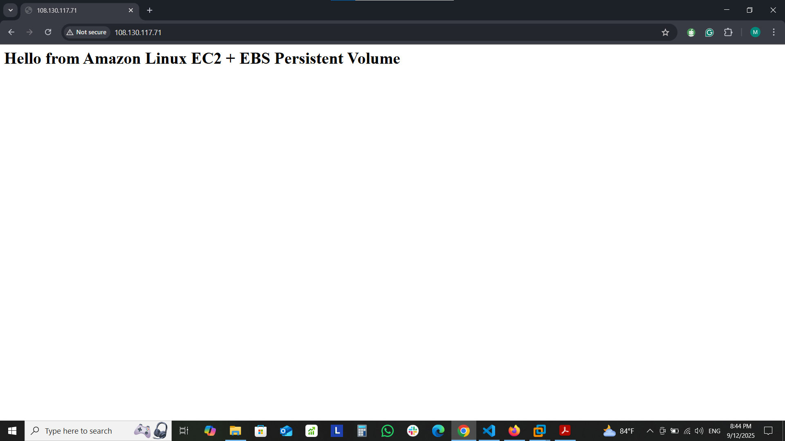

# EC2 + EBS Persistent Web Server 

## 📌 Overview
This project sets up a **web server on Amazon EC2 instance** with an attached **EBS volume**.  
Apache (httpd) web root is moved to the EBS volume to ensure data persists even when the EC2 instance is stopped and started.

**AWS Services Used:**
- EC2 (Amazon Linux 2023, t2.micro free tier)
- EBS (5GB, free tier)
- IAM (for secure access)
- Security Groups (to control SSH/HTTP access)

---
## ⚙️ Steps to Reproduce

### 1. Launch EC2 Instance
- Instance type: `t2.micro`  
- Security Group:  
  - Allow SSH (22) from your IP  
  - Allow HTTP (80) from anywhere
### 2. Create and Attach EBS Volume
- Size: 5 GB  
- AZ: Same as EC2 instance  
- Attach volume to EC2
### 3. Connect and Configure EBS
```bash
ssh -i mykey.pem ec2-user@<EC2_PUBLIC_IP>
# Check available disks
lsblk

# Format EBS volume
sudo mkfs.ext4 /dev/xvdf

# Mount volume
sudo mkdir /data
sudo mount /dev/xvdf /data

# Persist mount across reboots
echo "/dev/xvdf /data ext4 defaults,nofail 0 2" | sudo tee -a /etc/fstab
```
### 3. Install Apache & Move Web Root to EBS
```bash
sudo yum  update -y
sudo yum install -y httpd
sudo systemctl enable httpd
sudo systemctl start httpd

# Move default web root to EBS
sudo mv /var/www/html /data/html
sudo ln -s /data/html /var/www/html

# Add sample webpage
echo "<h1>Hello from EC2 + EBS Persistent Volume</h1>" | sudo tee /data/html/index.html
# Restart Apache
sudo systemctl restart httpd
```
### 5. Test Website
Open a browser:
```bash
http://<EC2_PUBLIC_IP>
```
You should see the message:
```bash
Hello from Amazon Linux EC2 + EBS Persistent Volume
```
### 6. Test Persistence
- **Stop EC2 instance.**
- **Start it again.**
- **Verify website still loads → files persisted on EBS volume.**
---

## 🧪 Verification
- ✅ Web server runs and serves content via `http://<EC2_PUBLIC_IP>`  
- ✅ Security Group allows HTTP & SSH
- ✅ Content persists after stop/start  

---
## 📷 Deployment Verification
- **Apache Homepage**


## 📂 Project Structure
```text
ec2-apache-project/
│── README.md
│── screenshots/
│ ├── apache-homepage.png
│ ├── ec2-console.png
│ ├── security-group.png
│── install_apache.sh
```
---
## 📜 Automation Script
```bash
#!/bin/bash
sudo yum  update -y
sudo yum install -y httpd

sudo systemctl enable httpd
sudo systemctl start httpd
echo "<h1>Hello from Apache on Amazon Linux 2023</h1>" > /var/www/html/index.html
```
---
## 🧹 Cleanup
- Terminate EC2 instance
- Detach & delete EBS volume
- Delete security group


